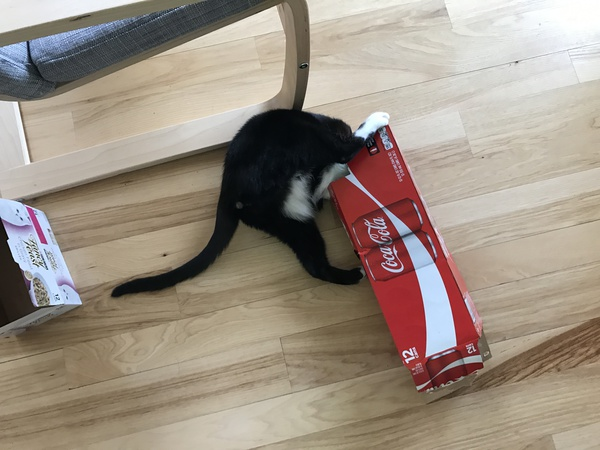
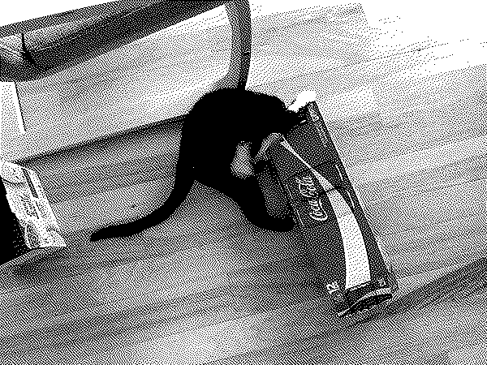
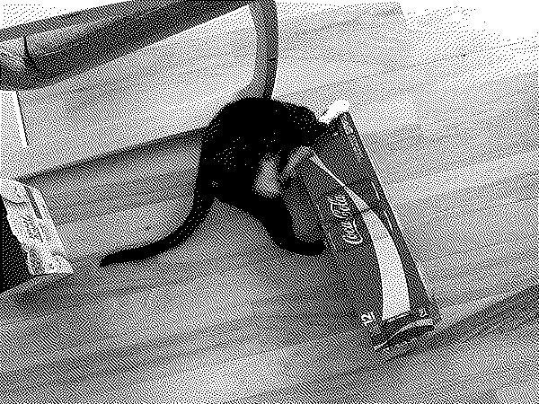

# Hyperdither.py

Simple Atkinson style dithering using Python.

To speed up the processing, this script requires numpy and numba.  I'm sure there are easy ways to do the same using pure C, but I don't know them.

## Example

Input image:

Command:

    hyperdither.py -1 cat.jpg

Output:

Reduced contrast:

    hyperdither.py -1 cat.jpg -c .85

## Options

- `-1`: 1-bit black and white file.  Otherwise the output is encoded as an RGB file.
- `-t`: the black/white threshold.  Everything above is black.  The maximum is 255.
- `-d`: dpi out output file.  Only for printing purposes.  Default is 72 dpi.
- `-e`: output filetype.  Must be accepted by PILLOW or it will throw an exception.  Default is png.
- `-b`: start at bottom left instead of top left with the dithering.
- `-c`: boost contrast by specified amount (in terms of [pillow's][pillow] [ImageEnhancers][enhance] factor: 1 is no change).
- `-s`: boost sharpness by specified amount (in terms of [pillow's][pillow] [ImageEnhancers][enhance] factor: 1 is no change).
- `-r`: resize pre-dither image on longest dimension.  Makes the image smaller only, pre-dithering.
- `-2`: double post-dither image using nearest neighbors.  Makes output image twice as large as the pre-dither image.  If image is scaled from the resized pre-dither image if the `-r` option was specified.

For contrast and sharpness, 1 is default and does not need to be specified.  Numbers larger than 1 increase sharpness/contrast, numbers below 1 reduce it.  Negative numbers for contrast invert the image.  If you want to go negative, I found that specifying the option like `-c"-1"` will give you minus 1.  Remove the space and surround the argument by quotes.

I found values of 0.8 to 1.2 are good for contrast if you want lighten or darken specific areas.

## Requirements

- [pillow][] 
- [numpy](http://www.numpy.org)
- [numba](http://numba.pydata.org)

[pillow]: http://python-pillow.org
[enhance]: https://pillow.readthedocs.io/en/4.0.x/reference/ImageEnhance.html
